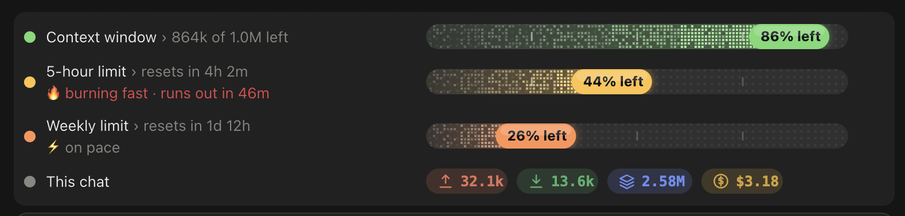

# Progress Board — User Guide

*v2.5.1 · Claude desktop app (Code tab) and `claude` in the terminal.*

A small panel that always sits **above the prompt box**. It shows what Claude is working on, how much usage you have left, and what went wrong. It turns on automatically in every session.

**Reading a row:** the **dot** on the left shows the status (green = plenty left, yellow = about half, orange/red = running low). The **label** shows details such as *"864k of 1.0M left"* or *"resets in 4h 2m"*. The **bar** on the right fills with what has been used, and the badge shows **% left**.

---

## What's on the board

| Row | What it tells you |
|---|---|
| **Task bars** | Multi-step work split into stages and steps: done steps are filled, the active one glows, and errors are marked. A bar shows *waiting for you* when Claude needs a decision. Finished bars fold away after about 1 minute. |
| **Tasks** | Claude's own to-do list, ticked off as it goes. |
| **Agents** | One line per helper agent running in parallel. Finished agents fold into "+N more". |
| **Git** | Project · branch · lines added (+) and removed (−). Shown only inside a version-controlled project. |
| **Context window** | How much of Claude's memory for this chat is used. At **85% or more**, a **Compact** button appears: click it to summarise the chat and free up space. |
| **5-hour / Weekly limit** | Your account's usage allowance, with a countdown to the reset. |
| **This chat** | Usage figures for the current conversation (see below). |
| **Error button** | Appears when an action failed this turn. Click it to see which action failed and why. |

**Pace icons** on the limit rows:

| Icon | Meaning |
|---|---|
| 🍃 relaxed | Slower than the clock, so plenty to spare |
| ⚡ on pace | Using it at about the expected rate |
| 🔥 burning fast | Faster than the clock. If it says *"runs out in …"*, you will hit the limit before it resets |

**Sounds** play when Claude needs your decision, when something fails, and when work is done.

### "This chat" row

A **token** is the unit Claude reads and writes, roughly one syllable or word piece. **k** means thousand and **M** means million.

| Chip | Example | Meaning |
|---|---|---|
| ↑ orange | 32.1k | **New input**: your messages, file contents, and results of actions Claude ran |
| ↓ green | 13.6k | **Output**: what Claude wrote, such as replies, files, and commands |
| Stack, blue | 2.58M | **Re-read from cache.** Each turn, Claude re-reads the whole chat. Earlier parts come from the cache at about 1/10 of the cost. This number is always the largest and grows as the chat gets longer. That is normal. |
| $ yellow | $3.18 | **Estimated cost at API prices.** On a Claude subscription **you are not charged this**. The 5-hour and weekly limits are what actually get used up. |

Optional chips appear when data is available: ◷ total working time · ▸ current or last task time · ⏳ how long the cache stays warm (**cold** = expired) · ⚡ writing speed · ⚙ last tool used · § skills in use.

---

## Commands

| Command | Action |
|---|---|
| `/progress` | Show or hide the whole board (same as the **Progress** button below the prompt) |
| `/progress-usage` | Show or hide the context, limit, and "This chat" rows |
| `/progress-demo` | Show a sample task bar |
| `/progress-clear` | Remove all task bars |
| `/progress-errors` | List this turn's failed actions and the reasons |
| `/progress-sounds` | Play the three sounds |

## Tips

- **Context almost full?** Click **Compact** before starting a big new task.
- **Cache chip in the millions?** Start a **new session** for a new topic. It is much cheaper than continuing a long chat.
- **🔥 "runs out in 46m" but the reset is hours away?** Postpone heavy work.
- **⏳ still warm?** Replying now is faster and cheaper.

## Troubleshooting

| Problem | Fix |
|---|---|
| No board | Type `/progress` (it may be hidden). If it still does not show, quit Claude with **⌘Q** and reopen it. |
| Two boards | Ask Claude to disable the duplicate board. |
| No sound | Run `/progress-sounds`, then check the Mac volume and Do Not Disturb. |
| No limit rows | They appear after Claude's first reply. With an API key, the amount spent is shown instead. |

## Update or remove

- **Update:** run `git pull`, run the installer again, then restart Claude.
- **Remove:** ask Claude to remove Progress Board. Settings are backed up before every change.

---

*Fork of [plan-progress](https://github.com/zycck/claude-mods) by Kirill Serditov (MIT).*
